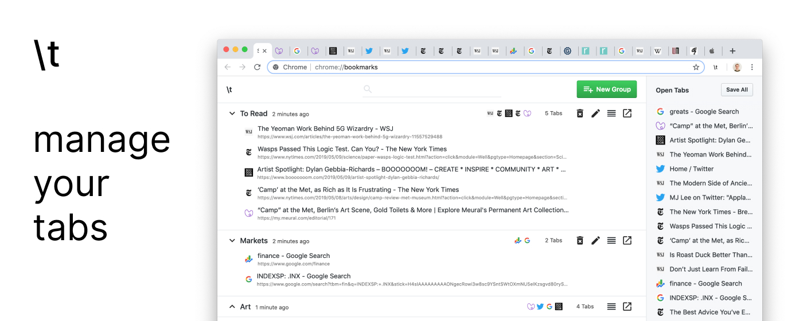

---

[Slash Tab](https://chrome.google.com/webstore/detail/slash-tab/clblmncpnncpnknhfddlbmnpkgdepfeh) is a Chrome extension that solves the problem of having too many open browser tabs. It allows you to save, organize, and search your tabs in a beautiful interface.

I've often found myself with several browser windows open, all of which are full of tabs. None of these tabs is worth bookmarking, since my interest in them is transient, but none is worth closing either. I wrote Slash Tab to provide a space to save and organize such tabs so that they may be closed and restored later.

The name `\t` comes from the escape sequence for a whitespace tab character used in many programming languages.

### Features

- Save tabs into groups
- Search tabs
- Sort tabs and groups
- Open all tabs in a group simultaneously
- Rename tabs and groups
